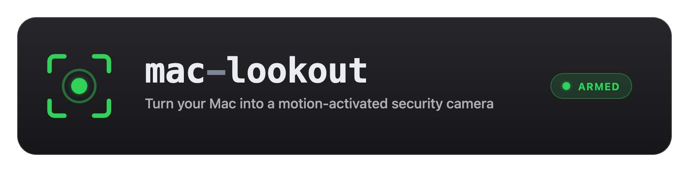
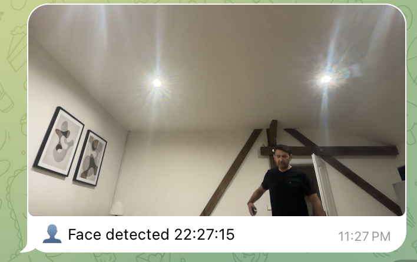

<p align="center">
  
</p>

# mac-lookout — macOS Motion Security Monitor

Turn a Mac and its **built-in FaceTime camera** into a motion-activated security
camera — no extra hardware, no Raspberry Pi, no IP camera. When motion is
detected it saves timestamped snapshots locally, mirrors them to **iCloud
Drive**, and pushes them to your phone in real time over a **Telegram bot** that
you can also command remotely (`/photo`, `/status`, `/pause`, `/resume`).

It keeps working while the screen is locked, takes a periodic "heartbeat"
snapshot so you know it's alive, and waits a configurable delay after you press
start so you can leave the room without tripping it.

> Built for the travel / hotel-room case — *"is anyone going into my room while
> I'm out?"* — but it's just a webcam motion monitor, so the home-office,
> front-door, workshop, pet-cam, and "did the courier come?" cases all work too.

---

## The story

On a trip to Prague, I had the usual traveler's worry: a hotel room with my
laptop, passport, and other valuables in it, and no good way to know whether
anyone — housekeeping, or anyone else with a key — had been in while I was out.

Then it clicked: the most valuable thing in the room was *also* a camera, a
computer, and an internet connection. Why not make the laptop watch the room
itself?

That single idea set the requirements, and each one shaped the tool:

- **Use only the laptop — no extra gear.** I was traveling, not carrying a
  Raspberry Pi or an IP camera. → built around the **built-in FaceTime camera**.
- **Get evidence off the device immediately.** If the laptop itself walked out
  the door, local snapshots would walk with it. → every snapshot is **mirrored
  to iCloud Drive**, so I can see it from my phone even if the Mac is gone.
- **Alert me in real time, wherever I am.** A folder I check later isn't an
  alarm. → a **Telegram bot** pushes each snapshot instantly, and lets me pull a
  live photo, sound an alarm, or pause it on command.
- **Keep watching with the screen locked.** I'd lock the screen and leave. → it
  runs under **`caffeinate`** so the system stays awake and keeps capturing while
  the display sleeps.
- **Don't trip on me as I leave.** → an **arming delay** to walk out first.
- **Catch a face, not a blur.** The first seconds of an event are when identity
  is visible. → **dense capture up front** (plus optional face detection), then
  it slows down for long activity like housekeeping.
- **Tell me it's still alive.** A camera that silently died is worse than none.
  → a **heartbeat** snapshot every 30 minutes.

The original plan was the open-source `motion` daemon — but on macOS that's a
dead end (Homebrew's `motion` is an unrelated to-do app, and the real one can't
read the built-in camera). So this is that idea, rebuilt natively for a Mac.
It's framed around the hotel-room case, but it's just a webcam motion monitor —
home-office, front door, workshop, pet-cam, "did the courier come?" all work too.

<p align="center">
  
  <br>
  <em>The real thing in Prague: walking back into the room trips motion, and the
  Telegram bot pushes a "Face detected" snapshot to my phone in seconds.</em>
</p>

---

## Features

- 🎥 **Built-in camera, no extra gear** — uses the Mac's FaceTime camera via OpenCV.
- 🏃 **Motion detection** — frame differencing against a running-average
  background, tunable like the classic `motion.conf` knobs (threshold, noise
  floor, minimum motion frames), with an optional region-of-interest mask.
- 🔥 **Adaptive event capture** — on motion it saves a *sequence*: **dense at the
  start** (catch the face/identity in the first seconds), then automatically
  **slows down** during sustained activity (e.g. housekeeping) so you don't get
  hundreds of near-identical frames. Capturing continues ~10 s after motion stops.
- 👤 **Optional face detection** — when a face is found in a frame it's captioned
  "Face detected" and pushed even if the throttle would skip it (Haar cascade
  bundled with OpenCV — no extra dependencies; set `SM_FACE_DETECT=0` to disable).
- ☁️ **iCloud Drive mirroring** — every snapshot is copied to
  `iCloud Drive/mac-lookout/` so there's an off-device copy.
- 📲 **Telegram alerts + two-way control** — front-loaded photo push on motion
  (first frames sent immediately so you actually see who arrived), plus remote
  commands restricted to **your chat only**:
  - `/photo` — grab a picture right now (even with no motion)
  - `/status` — armed/paused state, event count, uptime
  - `/pause [min]` — pause detection for N minutes (default 10), **auto-rearms**
  - `/resume` — resume immediately
  - `/say <text>` — speak text aloud in the room (deterrence: *"I can see you"*)
  - `/alarm` — sound an alarm in the room
  - 🎙️ **send a voice message** — it plays aloud in the room (intercom)
  - `/help` — list commands
- ⏲️ **Arming delay** — `./start.sh 5` waits 5 minutes before detecting so you
  can walk out; you get an "ARMED" ping when it goes live.
- 💓 **Heartbeat** — a proof-of-life snapshot every 30 minutes; if heartbeats
  stop, you know the monitor died.
- 🔒 **Survives screen lock** — runs under `caffeinate` so the system stays
  awake and keeps capturing while the display sleeps and the screen is locked.

---

## How it works

A single Python process (`motion_detect.py`) owns the camera and runs the
detection loop. Because macOS allows only **one** process to use the camera at a
time, everything that needs a frame — motion snapshots, the periodic heartbeat,
and on-demand `/photo` — is served from that one loop. A daemon thread
long-polls Telegram for your commands and answers using the latest frame.
`start.sh` wraps the whole thing in `caffeinate` and backgrounds it; `stop.sh`
shuts it down and releases the camera cleanly.

```
start.sh ── caffeinate ── python motion_detect.py
                              ├── detection loop (owns camera)
                              │     ├── motion → snapshots/ + iCloud + Telegram push
                              │     └── heartbeat → heartbeat/ + iCloud
                              └── Telegram listener thread (/photo /status /pause …)
```

---

## Requirements

- macOS (tested on Apple Silicon, macOS 26).
- [`uv`](https://github.com/astral-sh/uv) recommended for the Python environment —
  `start.sh` auto-creates the venv with it. Any `python3` with OpenCV also works.
- [Homebrew](https://brew.sh) with `ffmpeg` (optional — powers the voice intercom
  and the standalone `heartbeat.sh` test grab).
- iCloud Drive enabled (optional) to mirror snapshots off-device.
- A Telegram account (optional, only if you want phone alerts/commands).
- Camera permission for your terminal (macOS will prompt on first run).

---

## Setup

```bash
git clone https://github.com/ergut/mac-lookout
cd mac-lookout
./start.sh
```

On first run, if `.venv` is missing and [`uv`](https://github.com/astral-sh/uv) is
installed, `start.sh` offers to create the virtualenv and install the Python
dependencies (OpenCV + numpy) automatically. It also runs preflight checks and
warns about anything missing (OpenCV, ffmpeg, Telegram credentials, iCloud Drive).

For the optional voice intercom (and the standalone `heartbeat.sh` test grab),
install ffmpeg:

```bash
brew install ffmpeg
```

<details>
<summary>Manual Python setup (no <code>uv</code>, or you prefer to do it yourself)</summary>

```bash
uv venv .venv
source .venv/bin/activate
uv pip install opencv-python-headless numpy
```

`start.sh` also accepts an already-activated venv or any `python3`/`python` on
your PATH — it just needs OpenCV importable there.
</details>

### Telegram (optional but recommended)

1. In Telegram, message **@BotFather** → `/newbot` → copy the **bot token**.
2. Send your new bot any message (so it may reply to you).
3. Message **@userinfobot** to get your numeric **chat ID**.
4. Create `secrets.env` from the template and fill both in:

   ```bash
   cp secrets.env.example secrets.env
   chmod 600 secrets.env
   # edit: SM_TELEGRAM_BOT_TOKEN=...  and  SM_TELEGRAM_CHAT_ID=...
   ```

`secrets.env` is gitignored and never committed. The token is passed to `curl`
via stdin, so it does not appear in process listings.

Without Telegram configured, mac-lookout runs **local-only**: motion and
heartbeat snapshots are still saved to `snapshots/` and `heartbeat/` (and
mirrored to iCloud Drive), but there are no phone alerts, no remote commands,
and no voice intercom. `start.sh` prints a warning when it starts in this mode.

---

## Usage

```bash
./start.sh        # default 5-minute arming delay, then watches the room
./start.sh 0      # arm immediately (handy for testing)
./start.sh 2      # 2-minute delay
./stop.sh         # stop and release the camera
```

For a real deployment: run `./start.sh`, **lock the screen** (Ctrl+Cmd+Q), and
leave — **keep the lid open and the power connected** so the camera keeps
capturing while the display sleeps.

Watch what's happening:

```bash
tail -f motion.log
```

### Where files go

| Kind | Local | iCloud |
|------|-------|--------|
| Motion snapshots | `snapshots/` | `iCloud Drive/mac-lookout/snapshots/` |
| Heartbeats | `heartbeat/` | `iCloud Drive/mac-lookout/heartbeat/` |

The iCloud copy goes to a fixed path
(`~/Library/Mobile Documents/com~apple~CloudDocs/mac-lookout/`), **independent of
where you clone the repo** — so getting evidence off-device just requires being
signed into iCloud with iCloud Drive enabled. If it's not, snapshots are still
saved locally under the project folder; the iCloud copy is skipped and `start.sh`
warns you at launch.

---

## Configuration

Override any of these as environment variables (e.g. `SM_THRESHOLD=3000 ./start.sh`):

| Variable | Default | Meaning |
|----------|---------|---------|
| `SM_THRESHOLD` | `1500` | Min changed-pixel area to count as motion (↑ = less sensitive) |
| `SM_NOISE_LEVEL` | `32` | Per-pixel diff intensity floor |
| `SM_MIN_FRAMES` | `2` | Consecutive frames required to confirm motion |
| `SM_EVENT_FAST_INTERVAL` | `0.6` | Seconds between frames during the dense start-of-event phase |
| `SM_EVENT_FAST_WINDOW` | `10` | How long (s) the dense phase lasts from the start of an event |
| `SM_EVENT_SLOW_INTERVAL` | `3` | Seconds between frames during sustained activity |
| `SM_EVENT_TAIL` | `10` | Seconds to keep capturing after motion stops |
| `SM_FACE_DETECT` | `1` | Face detection on (`1`) / off (`0`) |
| `SM_ARM_DELAY` | `0` | Arming delay in seconds (`start.sh` sets this from its minutes argument) |
| `SM_HEARTBEAT_SECONDS` | `1800` | Heartbeat interval; `0` disables |
| `SM_TELEGRAM_BURST` | `4` | Frames pushed to Telegram unthrottled at the start of an event |
| `SM_TELEGRAM_MIN_INTERVAL` | `30` | Min seconds between pushes after the initial burst |
| `SM_CAMERA_INDEX` | `0` | Camera index (`0` = built-in) |
| `SM_WIDTH` / `SM_HEIGHT` / `SM_FRAMERATE` | `1280` / `720` / `15` | Capture settings |
| `SM_MASK_FILE` | `mask.png` | Optional ROI mask: white = watch, black = ignore |

### Tuning

- **Too many false triggers** (light changes, AC, shadows): raise `SM_THRESHOLD`
  (try 2500–4000).
- **Missing real motion**: lower `SM_THRESHOLD` (try 800–1200).
- **Only watch part of the frame** (e.g. just the door): create a `mask.png` the
  same size as the frame — white where you want detection, black elsewhere.

---

## Maintenance

Snapshots and heartbeats accumulate indefinitely — by design, so evidence is
never auto-deleted. Clean them up yourself after confirming iCloud has what you
need:

```bash
rm -f snapshots/*.jpg heartbeat/*.jpg
```

---

## Prior art

The "camera + Telegram alerts" space is well-trodden; if you want a different
platform, these are worth a look:

- [scaidermern/piCamBot](https://github.com/scaidermern/piCamBot) — Raspberry Pi
  + Telegram, rich `/arm` `/disarm` `/capture` `/status` command set.
- [pchinea/telegram-surveillance-bot](https://github.com/pchinea/telegram-surveillance-bot)
  — cross-platform OpenCV webcam bot driven entirely from Telegram.
- [nicofirst1/MotionBot](https://github.com/nicofirst1/MotionBot) — OpenCV +
  Telegram with face recognition.

What mac-lookout does differently: it targets the **macOS built-in camera**
specifically, mirrors to **iCloud Drive**, survives **screen lock** via
`caffeinate`, adds a **timed `/pause` that auto-rearms** (vs. plain on/off), and
emits a **heartbeat** proof-of-life — a combination we didn't find in an
existing project. If you know of one that overlaps more, an issue/PR is welcome.

---

## ⚠️ Responsible use & disclaimer

This is a tool for monitoring **your own space, on your own device, with the
consent of anyone who may be recorded.** Like any camera software, it can be
misused — and that is on the user, not the authors.

- **Know the law.** Recording people — especially audio, or in places where
  there is a reasonable expectation of privacy (bathrooms, bedrooms, someone
  else's home, hotel common areas) — is regulated and varies by country, state,
  and context. It is your responsibility to comply with all applicable privacy,
  surveillance, wiretapping, and consent laws where you are.
- **Do not** use this to surveil people without their knowledge and consent, to
  stalk or harass, in any location or manner that is illegal, or in any way that
  violates someone's privacy or rights.
- **No warranty.** This software is provided "as is", without warranty of any
  kind. It may miss events, false-trigger, fail to upload, or stop without
  notice. **Do not rely on it as your sole security measure.**
- **No liability.** The authors and contributors accept no responsibility or
  liability for any misuse, damage, loss, legal consequence, or harm arising
  from the use of this software. By using it, you accept full responsibility for
  how you deploy it and for complying with the law.

Every technology can be used well or badly. Please use this one well.

---

## License

[MIT](LICENSE) — do whatever you want, no warranty. See the disclaimer above.
